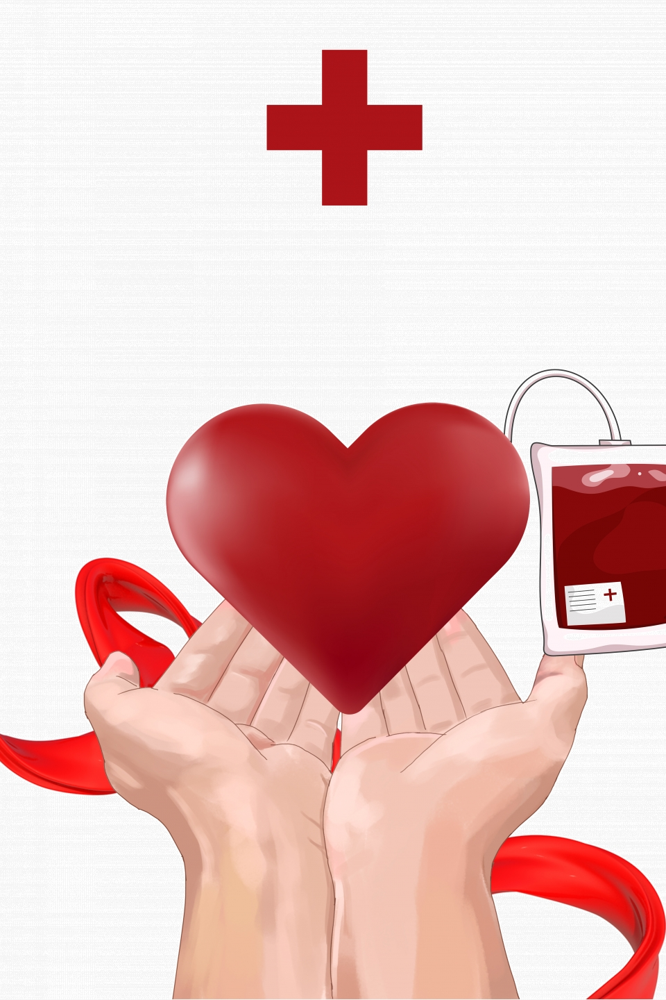
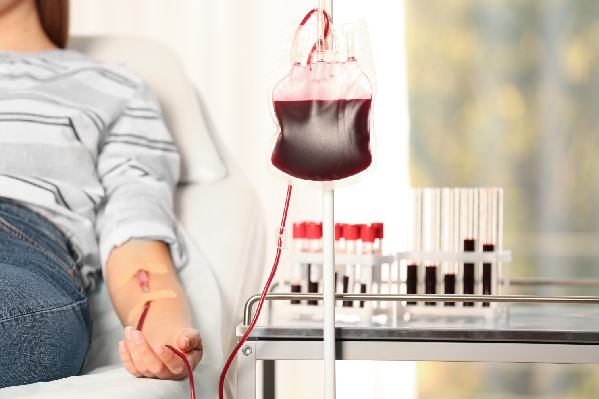
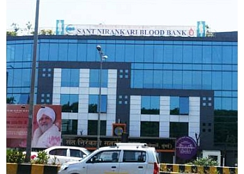
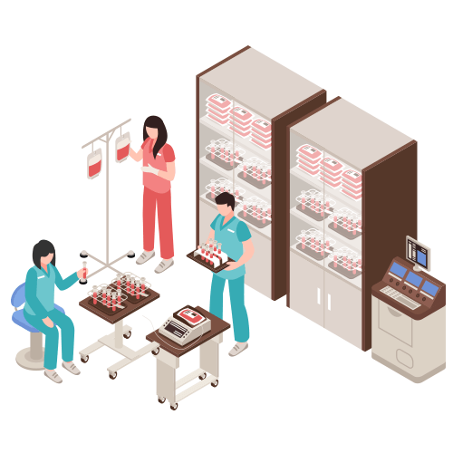
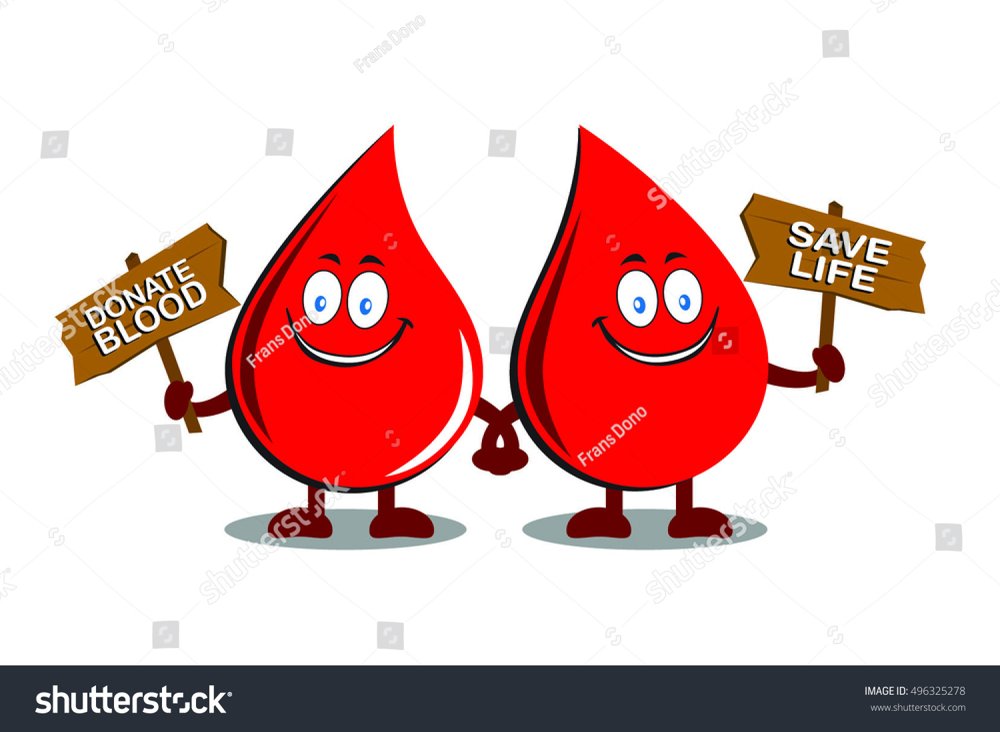
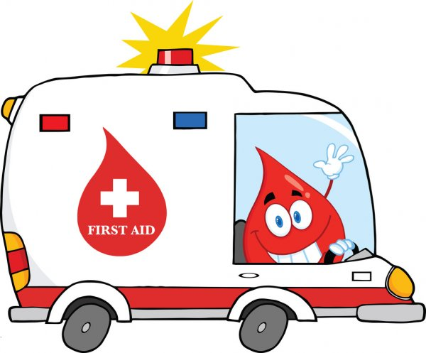
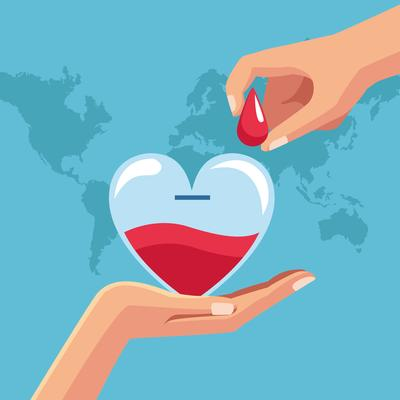

# rajk
<!doctype html>
<html lang="en">
  <head>
    <!-- Required meta tags -->
    <meta charset="utf-8">
    <meta name="viewport" content="width=device-width, initial-scale=1">

    <!-- Bootstrap CSS -->
    <link href="https://cdn.jsdelivr.net/npm/bootstrap@5.0.0-beta3/dist/css/bootstrap.min.css" rel="stylesheet" integrity="sha384-eOJMYsd53ii+scO/bJGFsiCZc+5NDVN2yr8+0RDqr0Ql0h+rP48ckxlpbzKgwra6" crossorigin="anonymous">

    <title>bb</title>

  </head>
  
 </head>

  <body data-spy="scroll" data-bs-target="#navbarSupportedContent">

    <nav class="navbar navbar-expand-lg navbar-light   ">

        

            <h><strong><i><a class="navbar-brand text-white" href="#" >BLOOD BANK</a></i></strong></h>
          <button class="navbar-toggler" type="button" data-bs-toggle="collapse" data-bs-target="#navbarSupportedContent" aria-controls="navbarSupportedContent" aria-expanded="false" aria-label="Toggle navigation">
            
          </button>
          

            <ul class="navbar-nav me-auto text-white d-flex justify-content-end">
              <li class="nav-item">
                <a class="nav-link active text-white" aria-current="page" href="#">Home</a>
              </li>
              <li class="nav-item">
                <a class="nav-link text-white" href="#">Link</a>
              </li>
              <li class="nav-item dropdown text-white">
                <a class="nav-link dropdown-toggle text-white" href="#" id="navbarDropdown" role="button" data-bs-toggle="dropdown" aria-expanded="false">
                  Dropdown
                </a>
                <ul class="dropdown-menu " aria-labelledby="navbarDropdown">
                  <li><a class="dropdown-item " href="#">Action</a></li>
                  <li><a class="dropdown-item" href="#">Another action</a></li>
                  <li>
</li>
                  <li><a class="dropdown-item" href="#">Something else here</a></li>
                </ul>
              </li>
              <li class="nav-item text-white">
                <a class="nav-link disabled" href="#" tabindex="-1" aria-disabled="true">Disabled</a>
              </li>
            </ul>
            <form class="d-flex" text-white>
              <input class="form-control me-2" type="search" placeholder="Search" aria-label="Search">
              <button class="btn btn-outline-success" type="submit">Search</button>
            </form>
          

        

      </nav>

    

<form id="login">
    <h1 class="text-center">BLOOD BANK</h1>

    
    

        <label>Email</label>
    <input type="email" placeholder="Enter the Email" class="form-control">
    

     
    

        <label>Password</label>
    <input type="password" placeholder="Enter the password" class="form-control">
    

     

    

        <label><input type="checkbox"> Remeber Me
        </label>
    

     

    <button type="submit" class="shadow-lg p-1 mb-1 btn btn-danger btn-md block ">Login</button>
  

  

    <a href="register.html" button type="submit" class="shadow-lg p-1 mb-1 btn btn-danger btn-md block" >Register</a>
  

        </form>
        

      

         
         
      
          <h1 class="section_title text-center text-white"><strong>About Blood Bank</strong></h1>
         
        
        

        

          

                
              

      
           
          

             
            
      
      

      
      
A blood bank is a center where blood gathered as a result of blood donation is stored and preserved for later use in blood transfusion. 
        The term "blood bank" typically refers to a division of a hospital where the storage of blood product occurs and where proper testing is performed .
         However, it sometimes refers to a collection center, and some hospitals also perform collection.
          Blood banking includes tasks related to blood collection, processing, testing, separation, and storage.
      
      

       

      

      

      
      

      

      
       
       
      
          

        

        
      
       
        

           
           
        
          <h1 class="section_title text-center text-white"><strong>How To Donate a Blood</strong></h1>

        

      
 

          

            

              

                
                

                  <h class="text-white"><strong>Blood Transfusion.</strong></h>
                  
 A blood transfusion is a way of adding blood to your body after an illness or injury. If your body is missing one or more of the components that make up healthy blood, a transfusion can help supply what your body is missing.

                

              

            

           

            

              

                
                

                  <h class="text-white"><strong>Transportaion of Blood</strong></h>
                  
Requirements for packing and transport.
                     Health providers should agree to a validated method for packing and transporting blood and 
                     blood products.
                      The typical way to deliver blood is by road, which often takes too long.

                  

                

              

            

            

              

                
                

                  <strong> <h class="card-text text-white text-center"> Blood Transfusion of another person.</h></strong>
 
                  
A blood transfusion is a safe and relatively simple medical procedure that Red blood cells carry oxygen to the body's tissues and remove CO2.
                    a transfusion can help supply what your body is missing.
                  

                 

              

            

            

              

                
                

                  <strong> <h class="card-text text-white text-center"> give Blood save life.</h></strong>

                  
Find blood donors using blood bank application. Search blood donors using blood donation application. Become a Volunteer. Give Blood. Types: A+, A-, B+, B-, AB+, AB-, O+, O-.
                  

                   
           
           
           
           
        
          
        
        
                  

              

            

            

              

                
                

                  <strong> <h class="card-text text-white text-center"> Transportaion of Blood by taxy, tempo.</h></strong>
 
                  
Today´s hospital environment is a complex logistical system where patients, different items and bloodsamples are being moved from A to B. A huge number of devices needed for the daily patient treatment is sent from storage rooms to designated areas where doctors and nurses need such components for patient treatment. 

                  
                    
                    
                  
                  
                  

                  

              

            

            

              

                
                

                  <strong> <h class="card-text text-white text-center"> why blood is important.</h></strong>

                  
Blood brings oxygen and nutrients to all the parts of the body so they can keep working. Blood carries carbon dioxide and other waste materials to the lungs, kidneys, and digestive system to be removed from the body. Blood also fights infections, and carries hormones around the body.
                  

                   
                  
                   
                  
          
                

              

            

          

        

      

    

      <!-- Footer -->
<footer class=" text-center text-white bk">
    <!-- Grid container -->
    

      <!-- Section: Social media -->
      <section class="mb-4">
        <!-- Facebook -->
        <a class="btn btn-outline-light btn-floating m-1" href="#!" role="button"
          ><i class="fab fa-facebook-f"></i
        ></a>
  
        <!-- Twitter -->
        <a class="btn btn-outline-light btn-floating m-1" href="#!" role="button"
          ><i class="fab fa-twitter"></i
        ></a>
  
        <!-- Google -->
        <a class="btn btn-outline-light btn-floating m-1" href="#!" role="button"
          ><i class="fab fa-google"></i
        ></a>
  
        <!-- Instagram -->
        <a class="btn btn-outline-light btn-floating m-1" href="#!" role="button"
          ><i class="fab fa-instagram"></i
        ></a>
  
        <!-- Linkedin -->
        <a class="btn btn-outline-light btn-floating m-1" href="#!" role="button"
          ><i class="fab fa-linkedin-in"></i
        ></a>
  
        <!-- Github -->
        <a class="btn btn-outline-light btn-floating m-1" href="#!" role="button"
          ><i class="fab fa-github"></i
        ></a>
      </section>
      <!-- Section: Social media -->
  
      <!-- Section: Form -->
      <section class="">
        <form action="">
          <!--Grid row-->
          

            <!--Grid column-->
            

              

                <strong>Sign up for our Blood Bank</strong>
              

            

            <!--Grid column-->
  
            <!--Grid column-->
            

              <!-- Email input -->
              

                <input type="email" id="form5Example2" class="form-control" />
                <label class="form-label" for="form5Example2">Email address</label>
              

            

            <!--Grid column-->
  
            <!--Grid column-->
            

              <!-- Submit button -->
              <button type="submit" class="btn btn-outline-light mb-4">
                Subscribe
              </button>
            

            <!--Grid column-->
          

          <!--Grid row-->
        </form>
      </section>
      <!-- Section: Form -->
  
      <!-- Section: Text -->
      <section class="mb-4">
        

            Register for Blood Donation Camp In your Area, Help the needy people, Donate Now.
             Donate & Save Tax. Support a child. Help old-age home.
              Support Girl Education. Amenities: Help Old Age people, & Orphns with Food,, 
              Clothes and, Shelter Support donation.
        

      </section>
      <!-- Section: Text -->
  
      <!-- Section: Links -->
    

    <!-- Grid container -->
  
    <!-- Copyright -->
    

      © 2020 Copyright:
      <a class="text-white" href="https://mdbootstrap.com/">MDBootstrap.com</a>
    

    <!-- Copyright -->
  </footer>
  <!-- Footer -->
      
      
      

      

    <!-- Optional JavaScript; choose one of the two! -->

    <!-- Option 1: Bootstrap Bundle with Popper -->
    

    <!-- Option 2: Separate Popper and Bootstrap JS -->
    <!--
    
    
    -->
  </body>
</html>
